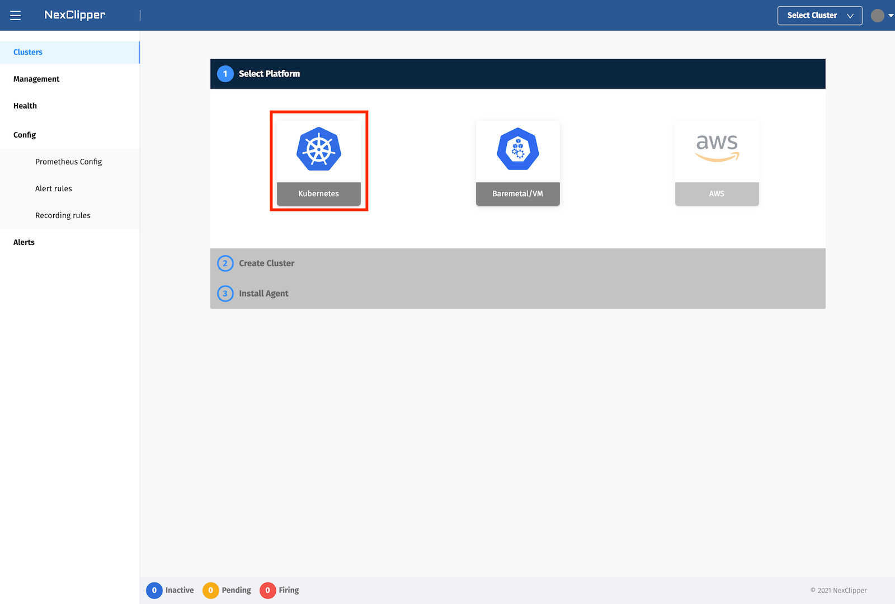
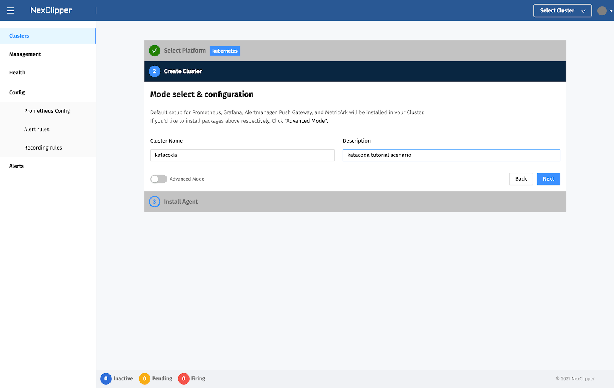
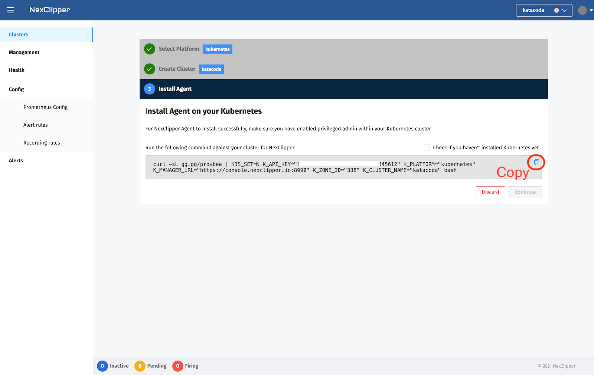

This environment has a `launch.sh`{{execute}}

You can get with `kubectl get nodes`{{execute}}


Go to [https://console.nexclipper.io/login](https://console.nexclipper.io/login) Page. And login with your Account.

Now, Create Cluster and enter the unique cluster name you want. At QuickStart, you should select Kubernetes platform to provision.  

And bootstrap script will be created to install on the selected platform.





Run the generated script from zsh, bash-enabled Bastion, or Local. And you are expected to get results similar to the following.  

```sh
curl -sL gg.gg/provbee | K3S_SET=N K_API_KEY="testapikeyd045612" K_PLATFORM="kubernetes" K_MANAGER_URL="https://console.nexclipper.io:8090" K_ZONE_ID="338" K_CLUSTER_NAME="katacoda" bash
```